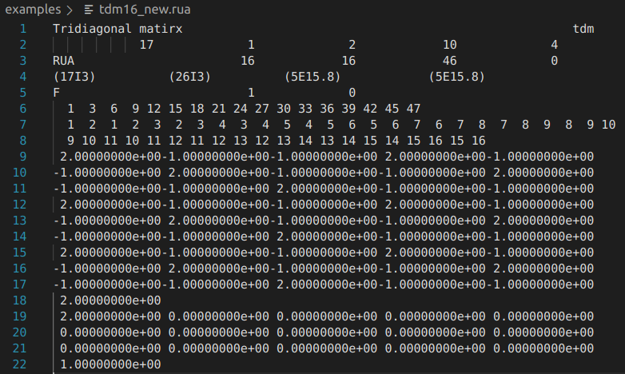

# SuperLU-Dist(KOR.)
**Date**: 2024.05.23 (Thur) <br>
**Writer**: Chanyoung Ahn ([cold-young](https://github.com/cold-young))

- KOR version 작성 후, ENG version 작성 예정.
- Reference: [Nurion-guide](https://docs-ksc.gitbook.io/nurion-user-guide-eng)
___

## What is `Harwell-Boeing (HB)` format (`.rua / cua`)? 
- **Reference:** [Link](https://people.sc.fsu.edu/~jburkardt/data/hb/hb.html)
- It is common to use the same compressed column storage to represent the matrix in memory.

    <br>

- Line 1: Title / KEY
- Line 2: 
  - Total number of data lines: `17`
  - Number of data lines for pointers: `1`
  - Number of data lines for row or variable indices: `2`
  - Number of data lines for numerical values of matrix entries: `10`
  - **PHSCRD** Number of data lines for right hand side vectors, starting guesses, and solutions: `4`
- Line 3: 
  - MATRIX TYPE: `RUA`(real, unsymmetric + square, assembled)
  - number of rows or variable: `16`
  - number of columns or variable: `16`
  - number of nonzero entires: `46`
  - number of elemental matrix entries, "assembled":0 `0`
- Line 4:
  - Fortran format ...
- Line 5 (PHSCRD>0):
  - describes the right hand side information: `F`  우변 정보 (전체)
  - the number of right hand side: `1`
  - number of row indices: `0`

- 6 row: point data / 행렬 항목의 시작 위치
- 7-8 row: index data / 각 항목에 해당되는 행의 인덱스
- 9-18 row: 값 데이터
- 19-22 row: 우변 데이터
## Examples

```shell
cds # cd scratch/$USERID
cd ~/examples

# Example: pddrive2.out & test.out
mpiicc -I$INC_SUPERLUD -L$LIB_SUPERLUD -lsuperlu_dist dreadhb.c dcreate_matrix.c dcreate_matrix_perturbed.c 
pddrive2.c -o pddrive2.out

# Example: test.out (monitor b matrix)
mpiicc -I$INC_SUPERLUD -L$LIB_SUPERLUD -lsuperlu_dist dreadhb.c dcreate_matrix.c dcreate_matrix_perturbed.c test.c -o test.out

# Test exampels
mpirun -np 4 ./OUTFILENAME.out -r 2 -c 2 tdm 16_new.rua 
```
### `dreadhb.c` # 
- Read double precision matrix stored in Harwell-Boeing format. 

### `dcreate_matrix.c` 
- Functions for reading the matrix with various formats
- `DCREATE_MATRIX_POSTFIX` read the matrix from data file in different formats (.rua, .rb, .mtx, .dat, .ddatnh, and .bin)

### `decreate_matrix_perturbed.c`
 * `DCREATE_MATRIX_PERTURBED` 
   * read the matrix from data file in Harwell-Boeing format, and distribute it to processors in a distributed compressed row format. It also generate **the distributed true solution X** and **the right-hand side RHS**.
   * `iam`: `iam` means current processor's rank (ID)

* `DCREATE_MATRIX` read the matrix from data file in Harwell-Boeing format, and distribute it to processors in a distributed compressed row format. It also generate the distributed true solution X and the right-hand.
  
### `pddrive2.c` and `test.c`
* These examples illustrate how to use PDGSSVX to solve systems repeatedly w/ the same sparsity pattern of matrix A.