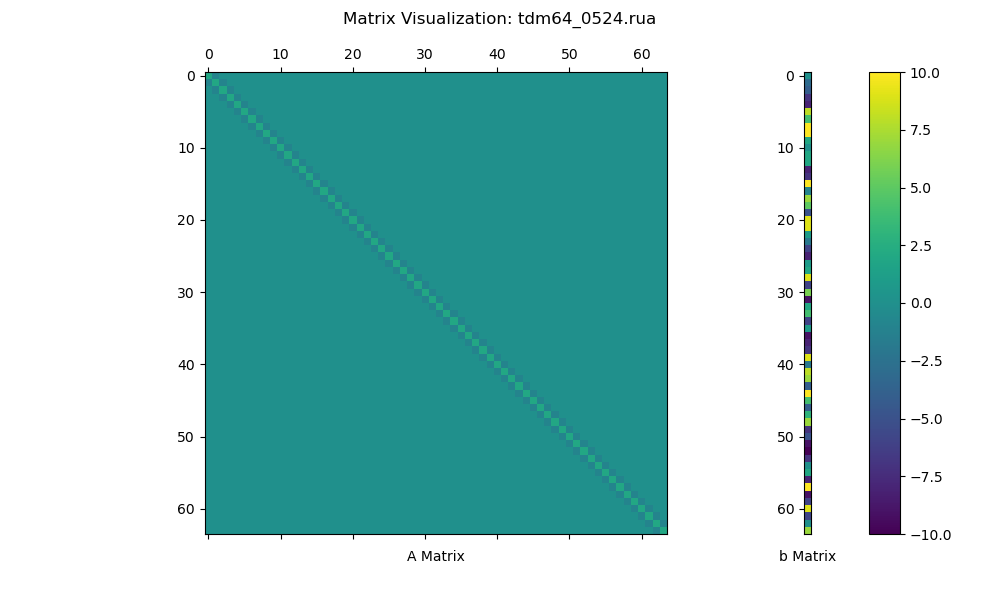

# Utils
**Date**: 2024.05.24 (Fri) <br>
**Writer**: Chanyoung Ahn ([cold-young](https://github.com/cold-young))

___

## Generate Tridiagonal Matrix
- `generate_matrix.py`
  - Generate tridiagonal matrix w/ Harwell-Boeing (HB) format (.rua).
  
```shell
python generate_matrix.py --dim=${DIM_INT} --path=${PATH} --name=${FILE_NAME}
```
- `dim`: Dimension of matrix. Default is 16. (i.e., `--dim=16`)
- `path`: Path for saving matrix file. Default is `./matrix_data`. (i.e., `--path=/home/$USER/data`)
- `name`: Name of matrix file. Default is `tdm${DIM}_%m%d.rua`. (i.e., `--name=tdm16_example`)

## Visualize Matrix 
- `matrix_visualizer.py`
  - Visualize matrix in .rua file.
  
```shell
python matrix_visualizer.py --name=${FILE_NAME.rua} --path=${PATH} --number=True
```
- `path`: Path for saving matrix file. Default is `./matrix_data`. (i.e., `--path=/home/$USER/data`)
- `name`: Name of matrix file. Default is `tdm16_example.rua`. (i.e., `--name=tdm16_example.rua`)
- `number`: Default is `False` (i.e., `--number=True`)

### Result


<!-- 

## Test matrix w/ superlu_dist (experimental)
### 16 dim


### 20 dim


### 1000 dim
 -->

