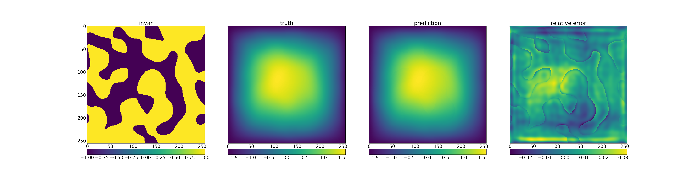

# Installation & Test
**Date**: 2024.05.14 (Tue) <br>
**Writer**: Chanyoung Ahn ([cold-young](https://github.com/cold-young))

## Summary
- [Installation \& Test](#installation--test)
  - [Summary](#summary)
  - [What is Modulus?](#what-is-modulus)
    - [PINN (Physics-informed Neural Networks)?](#pinn-physics-informed-neural-networks)
  - [Installation](#installation)
  - [Examples](#examples)
    - [Example: `fno_darcy.py`](#example-fno_darcypy)
  - [On-going](#on-going)

## What is Modulus? 
- NVIDIA Modulus is an open-source framework for building, training, and fine-tuning Physics-ML models with a simple Python interface. 
- Modulus supports the creation of large-scale digital twin models across various physics domains, from computational fluid dynamics and structural mechanics to eletromagnetics. 
- (maybe) NVIDIA modulus enable to use **PINN**  

### PINN (Physics-informed Neural Networks)?
  *Reference*: [Link](https://pasus.tistory.com/162)
- PINN proposed by Raissi.
- Mesh-free method unlike previous numerical methods (FEM, FDM, ..)
  - Accurate PDE solutions can be obtained in a relatively short time
- Potential to replace existing numerical solvers such as Fluent or OpenFOAM. 

## Installation
- Written *Prerequisties* in [README.md](../README.md)
- `Docker` > `conda`, `venv` 
  - Some examples enable test only `Docker` (`moulus_sym` examples)

## Examples

```shell
# Git clone modulus examples
git clone https://github.com/NVIDIA/modulus.git

# Test examples
cd ./modulus/examples/cfd/darcy_fno/
pip install warp-lang   
# Warp is not included in Modulus container

python train_fno_darcy.py
```
- I install `wandb` and `mlflow` to test *darcy_fno* example
- If you want to monitor the progress, 
  ```shell
  
  mlflow ui -p 2458
  
  # View progress in a browser at 
  http://127.0.0.1:2458
  ```
  - [mlflow](https://mlflow.org/docs/latest/index.html) seems like `wandb` and `tensorboard` .. (But I don't know how different these tools are)


### Example: [`fno_darcy.py`](https://docs.nvidia.com/deeplearning/modulus/modulus-v2209/user_guide/neural_operators/darcy_fno.html)
  <br>
  - validation_044.png
  - **Tested**: Intel i7-13700K, NVIDIA GeForce RTX 4070
  - (Honestly) I don't know Darcy Flow... and the meaning of this figure, (I'll study Darcy Flow...)

## On-going
- Test another examples like weather, cfd, and molecular dynamics 
- Create EXTREMLY simple CFD examples
- Test on HPC in KISTI (maybe, NEURON)