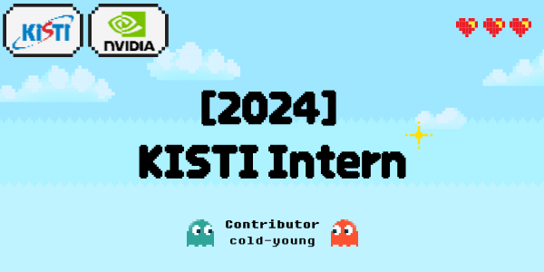

# 2024 KISTI Intern 

[](https://docs.python.org/3/whatsnew/3.10.html)
[](https://releases.ubuntu.com/20.04/)


Contributor: [Chanyoung Ahn](https://github.com/cold-young) 

## Prerequisites 

```shell
git clone https://github.com/cold-young/2024_KISTI_Intern.git
```

```shell
# Install conda env.
conda env create -f requirements.yaml

# Activate my env.
conda activate just_use
```

## Sturucture
### TDMA Utils

- This utils provide python files to develop [PaScaL_TDMA](xccels.github.io/PaScaL_TDMA/) documents.

### NVIDIA Modulus

- Study NVIDIA Modulus & prepare some tutorials. 
<br><br>
- **What is NVIDIA Modulus?**<br>
  - [NVIDIA Modulus](https://developer.nvidia.com/modulus) is an open-source framework for building, training, and fine-tuning Physics-ML models with a simple Python interface.